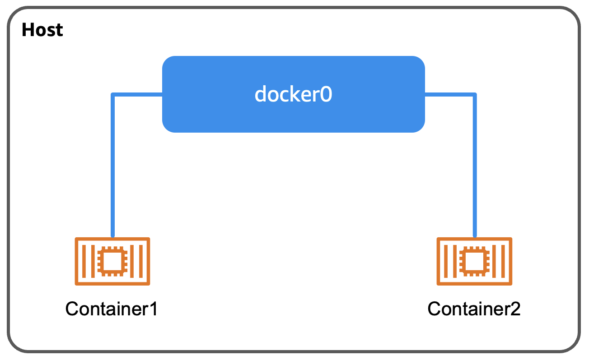

# docker0

> [!IMPORTANT]
> 最初に `colima ssh` で Colima VM (Linux) に SSH で接続することを忘れない

## docker0 とは

docker0 は Docker がホスト上に作成するデフォルトの仮想ブリッジインタフェースで、Docker コンテナ同士を接続する。



## ネットワークの設定を確認

```shell
$ ip addr show

3: docker0: <NO-CARRIER,BROADCAST,MULTICAST,UP> mtu 1500 qdisc noqueue state DOWN group default
    link/ether XX:XX:XX:XX:XX:XX brd ff:ff:ff:ff:ff:ff
    inet 172.17.0.1/16 brd 172.17.255.255 scope global docker0
       valid_lft forever preferred_lft forever
    inet6 YYYY::YYYY:YYYY:YYYY:YYYY/64 scope link
       valid_lft forever preferred_lft forever
```

### コンテナを立ち上げる前

#### 1 行目

```shell
3: docker0: <NO-CARRIER,BROADCAST,MULTICAST,UP> mtu 1500 qdisc noqueue state DOWN group default 
```

- `3`: インタフェースのインデックス
- `docker0`: インタフェースの名前
- `<NO-CARRIER,BROADCAST,MULTICAST,UP>`
  - `NO-CARRIER`: キャリア信号なし (何も接続されていない)
  - `BROADCAST`: ブロードキャストの有効化
  - `MULTICAST`: マルチキャストの有効化
  - `UP`: インターフェースは有効化されている
- `mtu 1500`: インタフェースの最大転送単位 (Maximum Transmission Unit)
- `qdisc noqueue`: キューイングなし (即座に転送)
- `state DOWN`: リンク状態がダウン (コンテナ未接続のため)
- `group default`: インタフェースのグループ

#### 2 行目

```shell
link/ether XX:XX:XX:XX:XX:XX brd ff:ff:ff:ff:ff:ff
```

- `link/ether`: イーサネットリンク層
- `XX:XX:XX:XX:XX:XX`: docker0 の MAC アドレス
- `brd ff:ff:ff:ff:ff:ff`: ブロードキャストアドレス

#### 3, 4 行目

```shell
inet 172.17.0.1/16 brd 172.17.255.255 scope global docker0
   valid_lft forever preferred_lft forever
```

- `inet`: IPv4 アドレス
- `172.17.0.1/16`: docker0 の IP アドレス
- `brd 172.17.255.255`: IPv4 ブロードキャストアドレス
- `scope global`: グローバルスコープ (全インタフェースから到達可能)
- `docker0`: このアドレスが割り当てられているインターフェース名
- `valid_lft forever`: 有効期限 (この IPv4 アドレスが有効な期間)
- `preferred_lft forever`: 優先使用期限 (この IPv4 アドレスが優先的に使用される期間)

#### 5, 6 行目

```shell
inet6 YYYY::YYYY:YYYY:YYYY:YYYY/64 scope link
   valid_lft forever preferred_lft forever
```

- `inet6`: IPv6 アドレス
- `YYYY::YYYY:YYYY:YYYY:YYYY/64`: docker0 の IPv6 アドレス
- `scope link`: リンクスコープ (このアドレスはリンクスコープのみから到達可能)
- `valid_lft forever`: 有効期限 (この IPv6 アドレスが有効な期間)
- `preferred_lft forever`: 優先使用期限 (この IPv6 アドレスが優先的に使用される期間)

### コンテナを立ち上げた後

テスト用に NGINX のイメージを用いてコンテナを立てる

```shell
$ docker run --rm -d nginx

$ ip addr show

3: docker0: <BROADCAST,MULTICAST,UP,LOWER_UP> mtu 1500 qdisc noqueue state UP group default
    link/ether XX:XX:XX:XX:XX:XX brd ff:ff:ff:ff:ff:ff
    inet 172.17.0.1/16 brd 172.17.255.255 scope global docker0
       valid_lft forever preferred_lft forever
    inet6 YYYY::YYYY:YYYY:YYYY:YYYY/64 scope link
       valid_lft forever preferred_lft forever

...

9: veth6f960b1@if2: <BROADCAST,MULTICAST,UP,LOWER_UP> mtu 1500 qdisc noqueue master docker0 state UP group default
    link/ether XX:XX:XX:XX:XX:XX brd ff:ff:ff:ff:ff:ff link-netnsid 0
    inet6 YYYY::YYYY:YYYY:YYYY:YYYY/64 scope link
       valid_lft forever preferred_lft forever
```

#### 1 行目

```diff
- 3: docker0: <NO-CARRIER,BROADCAST,MULTICAST,UP> mtu 1500 qdisc noqueue state DOWN group default

+ 3: docker0: <BROADCAST,MULTICAST,UP,LOWER_UP> mtu 1500 qdisc noqueue state UP group default
```

- `<BROADCAST,MULTICAST,UP,LOWER_UP>`
  - `NO-CAREER` -> `LOWER_UP`: 下位デバイスが接続された状態 (接続ができた)
- `state UP`: リンク状態がアクティブ (コンテナの接続があるため)

同じく追加されたインタフェース (veth) とは...

```diff
+ 9: veth6f960b1@if2: <BROADCAST,MULTICAST,UP,LOWER_UP> mtu 1500 qdisc noqueue master docker0 state UP group default
+     link/ether XX:XX:XX:XX:XX:XX brd ff:ff:ff:ff:ff:ff link-netnsid 0
+     inet6 YYYY::YYYY:YYYY:YYYY:YYYY/64 scope link
+        valid_lft forever preferred_lft forever
```

## クリーンアップ

```shell
$ docker rm -f $(docker ps -q | head -n 1)
```

<div align="right"><a href="./2_veth.md">次のページ</a></div>
