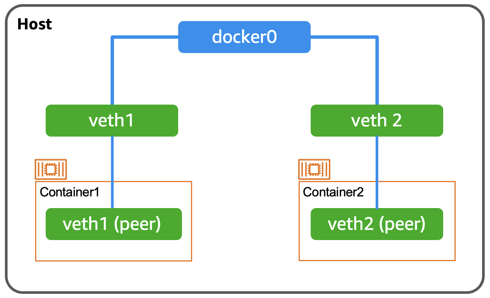

# veth (Virtual Ethernet Device)

> [!IMPORTANT]
> 最初に `colima ssh` で Colima VM (Linux) に SSH することを忘れない

Network Namespace 間のトンネルとして機能する仮想的なネットワークインタフェース。



<h4>特徴</h4>

- **常にペアで存在する双方向トンネル**: 片方から送信したパケットは、もう片方で受信される
- **L2 レイヤーで動作**: 物理的なイーサネットケーブルをシミュレート

## veth peer の作成

```shell
$ sudo ip link add name veth-tst type veth peer name veth-tst-peer
$ ip link show

# veth-tst と veth-tst-peer が作成されている
10: veth-tst-peer@veth-tst: <BROADCAST,MULTICAST,M-DOWN> mtu 1500 qdisc noop state DOWN mode DEFAULT group default qlen 1000
    link/ether XX:XX:XX:XX:XX:XX brd ff:ff:ff:ff:ff:ff
11: veth-tst@veth-txt-peer: <BROADCAST,MULTICAST,M-DOWN> mtu 1500 qdisc noop state DOWN mode DEFAULT group default qlen 1000
    link/ether YY:YY:YY:YY:YY:YY brd ff:ff:ff:ff:ff:ff
```

[コンテナを立てた](./1_docker0.md#コンテナを立ち上げた後)際、veth は 1 つしか表示されなかったはず...

```shell
# 再掲 (1_docker0.md)
9: veth6f960b1@if2: <BROADCAST,MULTICAST,UP,LOWER_UP> mtu 1500 qdisc noqueue master docker0 state UP group default
    link/ether XX:XX:XX:XX:XX:XX brd ff:ff:ff:ff:ff:ff link-netnsid 0
    inet6 YYYY::YYYY:YYYY:YYYY:YYYY/64 scope link
       valid_lft forever preferred_lft forever
```

## docker0 との接続

ホスト側の veth は docker0 にブリッジ接続している。

```shell
$ bridge link show

23: vethe0736e0@eth0: <BROADCAST,MULTICAST,UP,LOWER_UP> mtu 1500 master docker0 state forwarding priority 32 cost 2
```

## クリーンアップ

veth は peer は常にペアとして存在するため、どちらかを削除すると同時にもう片方も削除される。(単一のカーネルオブジェクトとして管理されている。)

```shell
$ sudo ip link delete veth-tst
```

<div align="right"><a href="./3_network_namespace.md">次のページ</a></div>
