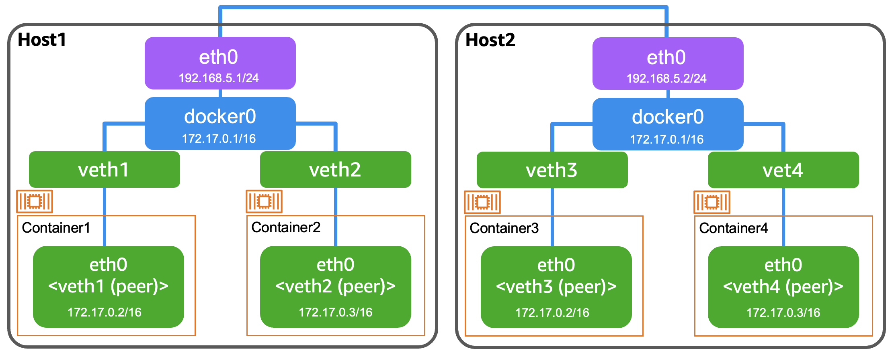
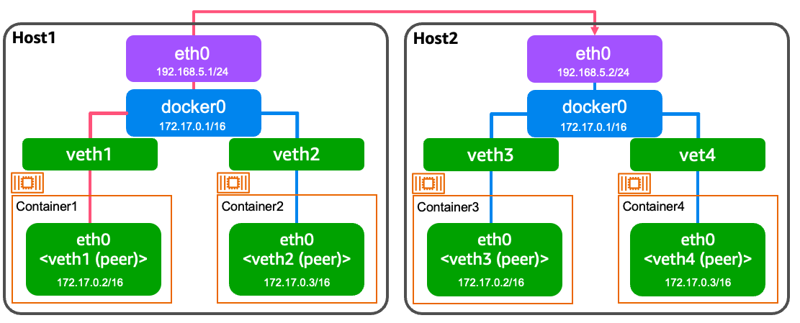
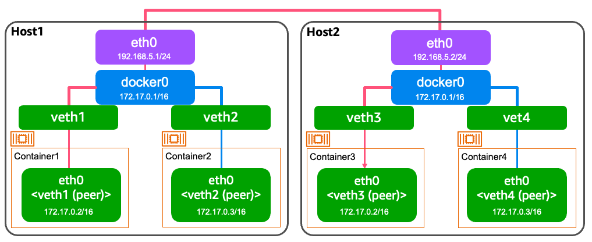

# Docker におけるホスト間コンテナ通信

> [!IMPORTANT]
> 事前準備
> 2 つのターミナルでそれぞれ Colima VM を立ち上げ、それぞれに SSH で接続する。
>
> ```shell
> # ターミナル1
> $ colima start --profile node1
> $ colima ssh --profile node1
> ```
>
> ```shell
> # ターミナル2
> $ colima start --profile node2
> $ colima ssh --profile node2
> ```

複数のホストにコンテナを配置すると以下のようになる。



## ホスト間コンテナ通信の問題

### Case1: (node1) コンテナ → (node2) eth0



1. node2 にて port 80 で listen する

```shell
#########
# node2
#########

# eth0 の IP を確認する
$ ip addr show

2: eth0: <BROADCAST,MULTICAST,UP,LOWER_UP> mtu 1500 qdisc fq_codel state UP group default qlen 1000
    link/ether 52:55:55:39:20:57 brd ff:ff:ff:ff:ff:ff
    inet 192.168.5.4/24 metric 200 brd 192.168.5.255 scope global dynamic eth0
       valid_lft 2125sec preferred_lft 2125sec                                                   
    inet6 fe80::5055:55ff:fe39:2057/64 scope link
       valid_lft forever preferred_lft forever

# port 80 で listen する
$ python3 -m http.server 80
```

2. node1 コンテナから node2 eth0 にアクセスする

```shell
#########
# node1
#########

# コンテナを立ち上げる
$ docker run --rm -d --name nginx nginx

# コンテナに入る
$ docker exec -it nginx /bin/sh

# node2 eth0 (この例では 192.168.5.4) にアクセスする
$ curl ${ETH0_IP}
```

上記より、(node1) コンテナ → (node2) eth0 はアクセスできることがわかる。

### Case2: (node1) コンテナ → (node2) コンテナ



eth0 は同じネットワーク空間であった一方で、docker0 ネットワークは隔離されたプライベートネットワークである。<br/>
そのため、node1 に存在するコンテナは node2 のプライベートネットワーク内に存在するコンテナにアクセスすることができない。

## Port Forwarding

Port Forwarding 機能を使うコンテナの外部からコンテナにアクセスできるようになる。(docker run の `-p` オプションは background にて iptables で DNAT を設定しているだけ)

```shell
#########
# node2
#########

# 一度コンテナを削除する
$ docker rm -f $(docker ps -q | head -n 1)

# port forwarding を設定する (node2 :80 → コンテナ :80)
$ docker run --rm -d -p 80:80 --name nginx nginx
```

```shell
#########
# node1
#########

# node2 eth0 (この例では 192.168.5.4) にアクセスする
$ curl ${ETH0_IP}
```
